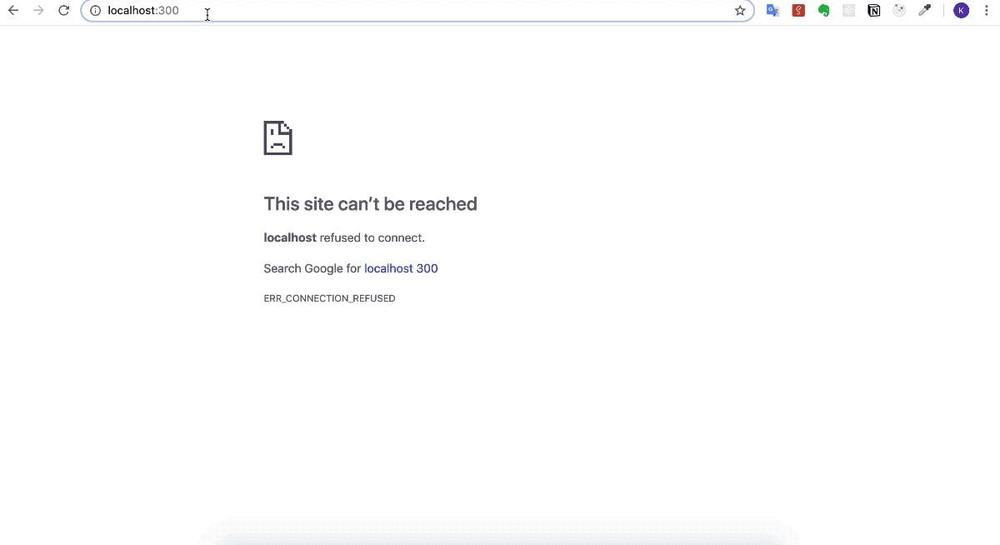

# Vanilla-Fake-Chat

React & Redux를 이용하여 가짜 채팅 어플리케이션을 만들어 보는 과제




## Setup

Install dependencies

```sh
$ yarn install (or npm install)
```

## Development

```sh
$ yarn start (or npm start)
# visit http://localhost:3000
```

## Features

* 기능
    * 채팅방 목록에서 채팅을 하고자 하는 사람을 선택하면, 해당 사람과 채팅할 수 있는 화면이 표시
    * 채팅 화면에서 메시지를 입력하면 채팅화면에 표시
* React/Redux/React Router을 사용해 SPA(Single Page Application)로 구현
